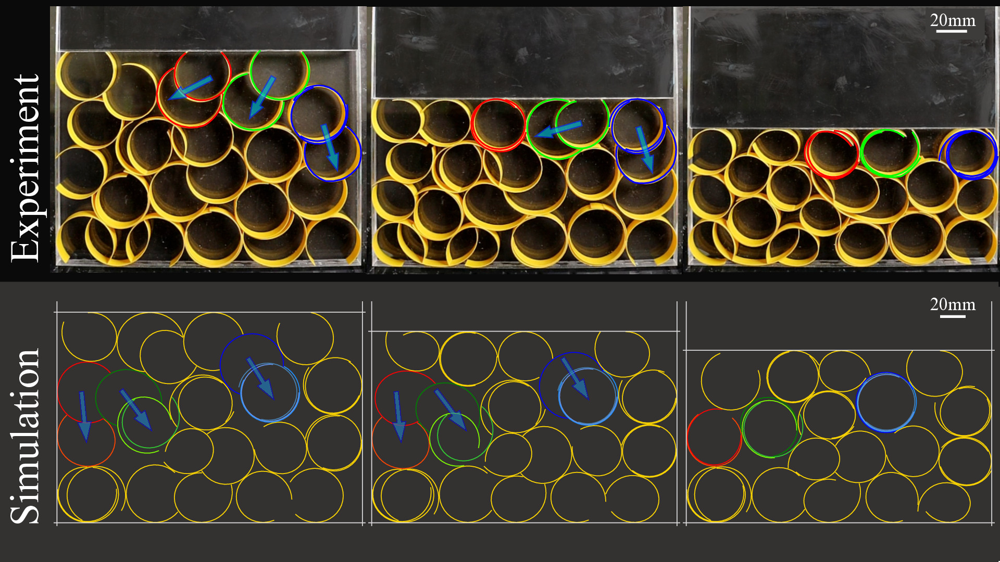

+++
title = "Randomly stacked open cylindrical shells as functional mechanical energy absorber"
date = 2023-08-25

[extra]
# Should be the type of the publication type it should appears under
# configured in the front matter of publications/_index.md
type = "journals"
authors = [ "Tomohiko G Sano*", "Emile Hohnadel*", "Toshiyuki Kawata", "Thibaut Métivet", "Florence Bertails-Descoubes" ]
featured = true
co_first_authors = true

publication = "Communications Materials 4, Article number: 59 (2023)"
# Add full url for your pdf and your presentation
url_pdf = "https://hal.science/hal-03996830/document"
# url_slides = "path_to_slides"
url = "https://www.nature.com/articles/s43246-023-00383-2"

# Add a link to a local pdf inside of your paper folder (example in content/publications/paper1.index.md)
# pdf = "paper.pdf"
# slides = "path_to_slides.pdf"
+++

