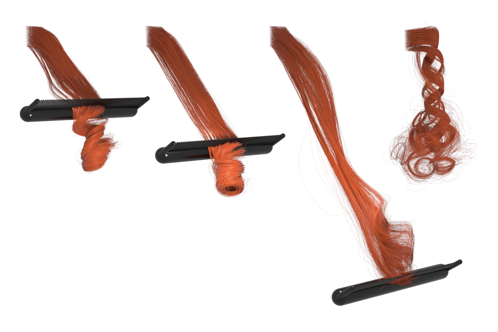

+++
title = "Contact detection between curved fibres: high order makes a difference"
date = 2024-07-19

[extra]
# Should be the type of the publication type it should appears under
# configured in the front matter of publications/_index.md
type = "journals"
authors = [ "Octave Crespel*", "Emile Hohnadel*", "Thibaut Métivet", "Florence Bertails-Descoubes" ]
featured = true
co_first_authors = true

publication = "ACM Transactions on Graphics 43, Article number: 132 (2024)"
# Add full url for your pdf and your presentation
url_pdf = "https://hal.science/hal-04364565v2/document"
# url_slides = "path_to_slides"
url = "https://dl.acm.org/doi/10.1145/3658191"

# Add a link to a local pdf inside of your paper folder (example in content/publications/paper1.index.md)
# pdf = "paper.pdf"
# slides = "path_to_slides.pdf"
+++

